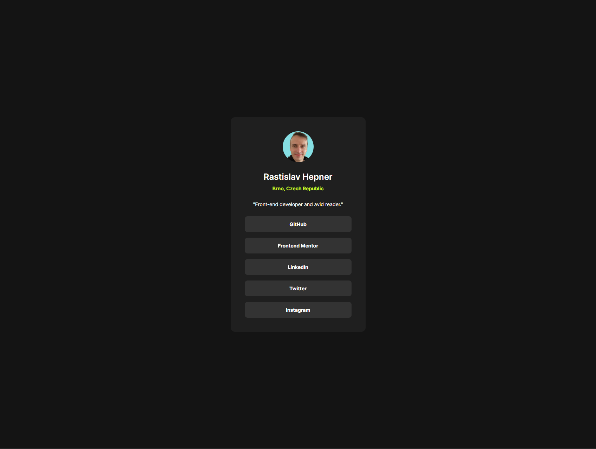

# Frontend Mentor - Blog preview card

This is a solution to the [Social links profile challenge](https://www.frontendmentor.io/solutions/social-links-profile-with-react-and-tailwind-48Cn2ec-Oo).

## Table of contents

- [Overview](#overview)
  - [The challenge](#the-challenge)
  - [Screenshot](#screenshot)
  - [Links](#links)
- [My process](#my-process)
  - [Built with](#built-with)
  - [What I learned](#what-i-learned)
  - [Continued development](#continued-development)
- [Author](#author)

## Overview

### The challenge

Build out this social links profile and get it looking as close to the design as possible.
You can use any tools you like to help you complete the challenge. So if you've got something you'd like to practice, feel free to give it a go.
Your users should be able to:
See hover and focus states for all interactive elements on the page

### Screenshot

### Links

- Live Site URL: [on netlify](https://sensational-kitten-6434f4.netlify.app/)

## My process

### Built with

- Mobile-first workflow
- [React](https://reactjs.org/) - JS library
- [Tailwindcss](https://tailwindcss.com/) - For styles

### What I learned

- Specifying explicit height harms responsiveness really bad and we better avoid it.
- Keep forgeting type for children in React

### Continued development

Getting hang of tailwindcss definitelly want to get better at it.

## Author

- Frontend Mentor - [@raswonders](https://www.frontendmentor.io/profile/raswonders)
- Twitter - [@raswonders](https://www.twitter.com/raswonders)
- LinkedIn - [Rastislav Hepner](https://www.linkedin.com/in/rastislavhepner/)
